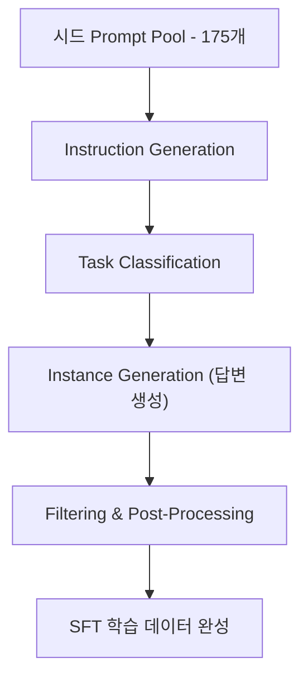

# 🧠 4강: Text Generation 3 — Small & Open Source LLMs
> 강필성 교수 (서울대학교 산업공학과)  
> 출처: NAVER Connect Foundation 강의 교재  
> 주제: **오픈소스 LLM, Self-Instruct 기반 데이터 구축, LLM 평가**

---

## **1️⃣ Open-Source LLM 개요**

### 🔹 LLM License Problem

- **LLM의 라이선스 구조**는 상업적 활용 가능 범위에 직접적인 영향을 줌  
- 대표 라이선스:
  | License | 특징 | 상업적 사용 |
  |----------|--------|--------------|
  | **MIT License** | 가장 개방적 | ✅ 가능 |
  | **CC-BY-SA 4.0** | 저작자 표시 및 동일조건 공유 필요 | ⚠ 조건부 가능 |
  | **Non-Commercial (NC)** | 비상업적 용도만 허용 | ❌ 불가 |

> 예시: **LLaMA 2**는 연구/비상업적 용도로 공개 → 기업은 Meta와 별도 계약 필요  
> 반면, **Falcon, Mistral** 등은 완전 오픈소스로 상업적 사용 가능.

---

### 🔹 LLaMA 모델

- Meta AI에서 개발한 대표적인 오픈소스 LLM 시리즈  
- **LLaMA 1 (2023.3)** → **LLaMA 2 (2023.7)** → **LLaMA 3 (예정, 2025)**  
- 모델 규모: **7B ~ 70B 파라미터**
- **PaLM 540B** 대비 **더 작은 파라미터로 동등 수준 성능**
- **학습 효율성 극대화**: “Chinchilla Scaling Law” 기반 학습 설계

---

### ⚙️ Chinchilla Scaling Law

- **DeepMind**에서 제안한 모델 효율성 법칙  
- 성능을 극대화하기 위해서는 **모델 크기와 데이터 크기의 균형**이 중요함  
  \[
  \text{Optimal Tokens} \propto \text{Model Parameters}
  \]
- LLaMA는 기존 모델보다 **데이터 양을 늘리고 모델 크기를 줄이는 전략**으로 학습 효율을 극대화함.

---

### 🔹 주요 Open-Source LLM 비교

| 모델 | 파라미터 | 개발사 | 특징 |
|------|-----------|--------|------|
| **LLaMA 2** | 7B~70B | Meta | 고성능·비상업용 |
| **Falcon** | 7B / 40B | TII (UAE) | 완전 오픈소스 |
| **Mistral** | 7B | Mistral AI | 효율성·속도 우수 |
| **StableLM** | 3B / 7B | Stability AI | 대화 중심 모델 |
| **OpenLLaMA** | 7B | OpenLM | LLaMA 복제 오픈 버전 |

---

## **2️⃣ Alpaca and its Friends**

### 🧩 Self-Instruct 개요

- **Self-Instruct** = “LLM이 LLM을 가르치는(Self-supervised)” 데이터 생성 방법론  
- 고품질의 **Instruction-Following 데이터**를 **자동 구축**
- 기존 Human Annotator 기반 데이터 대비  
  ✅ 비용 절감  
  ✅ 다양성 향상  
  ✅ 확장성 우수

---

### 🧠 Alpaca 프로젝트 (Stanford, 2023)

- Stanford에서 발표한 **LLaMA 7B SFT 프로젝트**
- **175개의 시드 데이터**를 이용해 **52,000개의 Instruction 데이터** 자동 생성
- **Self-Instruct 기반 자동 데이터 구축 → LLaMA Fine-Tuning**

> 결과적으로 **Human Annotation 없이도 GPT-3 수준의 SFT 데이터 확보**

---

### 🔸 Alpaca 이후 주요 오픈소스 SFT 모델

| 모델 | 기반 | 특징 |
|------|------|------|
| **Alpaca** | LLaMA 7B | Self-Instruct 데이터 |
| **Vicuna** | LLaMA 13B | 사용자 대화 로그 기반 |
| **KoAlpaca** | LLaMA 7B | 한국어 Self-Instruct |
| **OpenAssistant** | GPT-3 | 오픈 대화 데이터 |
| **Baize** | ChatGPT | 대화형 SFT 모델 |

---

## **3️⃣ Self-Instruct: 데이터 구축 파이프라인**

> 💡 **핵심 주제:** 18p 이후의 Self-Instruct 데이터 생성 및 품질 관리 과정

---

### **① Prompt Pool 구축 (Seed Prompt Collection)**

- **목적:** 초기 태스크 패턴 확보용 Prompt Pool 생성
- **방법:**
  - 사람이 직접 작성한 **175개 Instruction 샘플**을 시드로 사용
  - 각 샘플은 `(Instruction, Input, Output)` 구조
  - 주제 다양성 확보 (요약, 분류, 생성, 논리추론 등)
- **예시**
  ```text
  Instruction: 단어 h_ar_를 완성할 수 있는 단어를 알려줘.
  Input: h_ar_
  Output: heart, heard, hoard, hoary...
  ```

---

### **② Instruction Generation (새로운 태스크 생성)**

- **기존 시드 8개를 In-context Learning 예시로 제공**  
  → GPT-3이 **유사하지만 새로운 Instruction**을 생성
- “다음 예시를 참고하여 새로운 작업을 만들어줘” 형태의 Prompt 사용
- 수천 개의 다양한 Instruction을 자동 생성

---

### **③ Classification Task Identification (태스크 타입 분류)**

- **목적:** 태스크를 분류형/비분류형으로 구분  
  → 이후 데이터 생성 방식에 차별적 접근 가능
- **방법:**
  - GPT 모델에 In-context 예시 제공  
  - 각 Instruction이 분류(Classification)인지 여부를 판별
- **예시:**
  - “음식명을 카테고리로 분류하라” → Classification  
  - “요약문을 작성하라” → Non-Classification

---

### **④ Instance Generation (답변 생성)**

- 각 Instruction에 맞는 **Input–Output 페어 생성**
- GPT 모델을 이용해 Instruction에 대한 답변을 생성
- In-context 예시를 함께 제공하여 포맷을 유지

```text
Instruction: 다음 뉴스를 2문장으로 요약하라.
Input: {뉴스 전문}
Output: {요약문}
```

- **결과:** 완전한 `(Instruction, Input, Output)` 데이터셋 생성

---

### **⑤ Filtering & Post-Processing (데이터 품질 관리)**

**목적:** 자동 생성 데이터의 품질 확보 및 다양성 유지

#### 🔹 주요 절차
1. **유사도 필터링**
   - 기존 Prompt Pool과 유사도가 높은 데이터 제거 (Cosine Similarity 기준)
2. **비텍스트 태스크 제거**
   - 이미지/그래프 기반 태스크 제거
3. **형식 검수**
   - Output 포맷 불일치, 비논리적 응답 제거
4. **다양성 제어**
   - 반복된 Instruction 패턴 제한

#### 🔹 결과
- 불필요한 데이터 제거 후, **고품질·다양한 Instruction Pool** 확보  
- 이 데이터로 **LLaMA, Falcon, Mistral 등 SFT 학습 가능**

---

### **⑥ Supervised Fine-Tuning (SFT 학습 적용)**

- Self-Instruct 데이터를 기반으로 LLM을 SFT 학습  
- **Human 데이터 없이**도 Instruction Following 능력 강화

> 예시:
> ```
> Prompt: 달에 가는 법을 6살 아이에게 설명해줘.
> Output: "큰 로켓을 타고 달에 가요. 우주복을 입고 멋진 별들을 봐요."
> ```

---

### **📊 Self-Instruct 효과**

| 항목 | Human Annotation | Self-Instruct |
|------|------------------|----------------|
| 비용 | 인건비 중심, 고비용 | GPT API로 저비용 |
| 다양성 | 주제 한정, 편향 존재 | 자동 생성으로 다양성 확보 |
| 속도 | 수주~수개월 | 수시간~수일 |
| 품질 | 균일성 확보 어려움 | 후처리로 품질 관리 |
| 확장성 | 태스크 추가 제한 | 프롬프트 기반 무한 확장 가능 |

---

### **Mermaid 파이프라인 정리**



---

## **4️⃣ LLM 평가 방법 (Evaluation of LLMs)**

### 🎯 평가 목적
- LLM의 **범용성, 안전성, 추론력, 창의성**을 종합적으로 평가
- 기존 태스크 기반 평가(MRC, QA 등)와 달리  
  **"모델의 종합적 지능"**을 검증

---

### 🧩 주요 평가 데이터셋

| 데이터셋 | 설명 |
|-----------|------|
| **MMLU (Massive Multitask Language Understanding)** | 57개 과목(인문·과학·의학 등)으로 구성된 범용 평가 |
| **HellaSwag** | 문맥 이해 및 자연스러운 텍스트 선택 |
| **HumanEval** | Python 코드 생성 및 정답률 평가 |
| **GSM8K** | 수학적 추론 문제 |
| **BBH (Big-Bench Hard)** | 고난도 reasoning 태스크 |

---

### 💬 LLM 평가 프레임워크 — G-Eval

- LLM이 다른 LLM의 출력을 평가하는 자동화 플랫폼
- 인간 평가자와의 일치도 높음 (≥ 0.8)
- 품질, 일관성, 창의성 등 **다차원 평가 가능**

---

## **5️⃣ 향후 방향 및 이슈**

### ⚙ LLM의 새로운 방향성

- **Chain-of-Thought (CoT)**: 복잡한 reasoning을 단계적으로 수행  
- **Self-Diagnosis & Self-Debiasing**: 모델이 스스로 오류를 인식 및 수정  
- **RLHF 이후의 데이터 효율성 개선**  
- **Ethics & Bias Mitigation:** 사회적 편향 최소화가 핵심 과제로 부상

---

## ✅ **정리 요약**

| 구분 | 핵심 내용 |
|------|------------|
| **Open-Source LLM** | LLaMA, Falcon, Mistral 등 오픈 모델 급성장 |
| **Self-Instruct** | GPT 활용 데이터 자동 생성 — 175 → 52,000개 데이터 확장 |
| **데이터 구축 프로세스** | Prompt Pool → Instruction 생성 → Filtering → SFT |
| **LLM 평가** | MMLU, HellaSwag, HumanEval 등 범용 지능 측정 |
| **향후 연구 방향** | CoT, Self-Diagnosis, 데이터 효율·윤리 강화 |

---

📚 **참고 문헌**
- Wang et al., *Self-Instruct: Aligning LLMs with Self-Generated Instructions*, 2023  
- Touvron et al., *LLaMA: Open and Efficient Foundation Language Models*, 2023  
- Taori et al., *Alpaca: A Strong, Replicable Instruction-Following Model*, 2023  
- Dubey et al., *Mistral 7B: Open-Weight Dense Model*, 2023  
- OpenLLM Leaderboard (Hugging Face, 2024)  
- Huang et al., *G-Eval: NLG Evaluation using GPT-4*, 2023  

---
